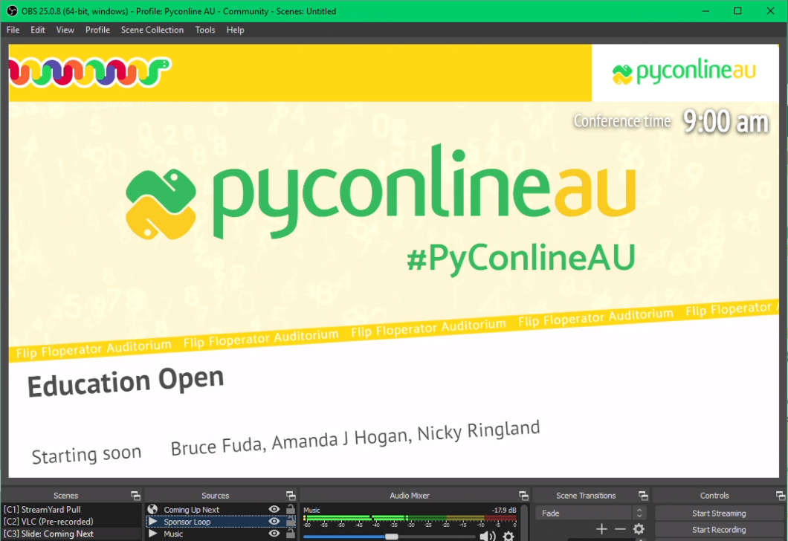

# veyepar-schedule-slide

Tool to display information about the next speaker for conferences with data in [Veyepar][].

This was originally developed for [PyconlineAU 2020][pyconau2020] – the original version with pretalx support [is available in the `pretalx` branch of this repository][pretalx].



**See also:** [description of slides, with more screenshots](./slides.md).

## Setting up

1. Provide a `schedule.json` from Veyepar:

   * live data: `./update_schedule.sh` (shell script, requires cURL)

   * live data: `update_schedule.ps1` (PowerShell script)

     [Requires signing][ps-sign], [an Unrestricted execution policy][ps-unrestricted], or running with `type | powershell`:

     ```powershell
     PS C:\...\veyepar-schedule-slide> type update_schedule.ps1 | powershell
     ```

2. Serve the checked-out `veyepar-schedule-slide` repository with a web server of your choice.

   For local development, you could use Python for this:

   ```shell
   $ python3 -m http.server -b 127.0.0.1
   ```

   **Warning:** Python's built-in web server is single threaded, and browsers will hold the TCP connection open after loading. This will prevent the page from being loaded in multiple browser windows (or OBS instances).

3. (Optional) If you wish to modify the HTML and CSS (such as change fonts), make a copy of the 'default' directory.

4. In OBS, create a `Browser` source:

   * URL: (replace with where you're hosting this, see [options](#options) below)
   * Dimensions: 1920x1080 (or 1280x720), must be 16:9 aspect ratio.
   * Shutdown source when not visible: enable
   * Refresh browser when scene becomes active: enable

## Setting up a new show

See `example/` for a sample show setup with custom CSS.

## Options

Options are set via query parameters:

* `r` **(required, string)**: Room name to display events for.

  This needs to match one of the values of `[].location` or `[].location_slug`, and is _case sensitive_.

  If no room is specified, an error and a list of valid rooms will be shown.

  **Example:** `?r=Magenta%20Room` displays events from `Magenta Room`.

* `c` **(optional, boolean)**: Only display the clock, and don't load the schedule.

  **Example:** `?c=1`

* `m` **(optional, string)**: Message to display when only showing the clock.

  **Example:** `?c=1&m=Hello%20world!`

* `lt` **(optional, datetime)**: Time to treat as the "load time" of this page, which becomes a persistent offset (time warp) when handling the schedule and displaying conference time.

  This is useful for testing, when the schedule data is in the past or future.

  This is passed verbatim to [JavaScript's `Date` constructor][date].

  **Example:** `?lt=2020-04-17T12:30:00+02:00` treats the load time as 2020-04-17 at 12:30 UTC+2.

* `client` and `show` **(optional, string)**: Client and show to read schedule data for from Veyepar.

  By default, this uses the `data-client` and `data-show` attributes of the `<body>` tag.

  **Example:** `?client=pycon&show=pycon_2021` will load in that specific schedule data, if it exists.

## Debugging keys

* <kbd>j</kbd>: time warp backward 5 minutes
* <kbd>Shift</kbd> <kbd>J</kbd>: time warp backward 30 minutes
* <kbd>q</kbd> or <kbd>h</kbd>: time warp backward 24 hours
* <kbd>k</kbd>: time warp forward 5 minutes
* <kbd>Shift</kbd> <kbd>K</kbd>: time warp forward 30 minutes
* <kbd>x</kbd> or <kbd>l</kbd>: time warp forward 24 hours
* <kbd>n</kbd>: disable time warp (ie: view schedule at "now")

## License

With the exception of per-show assets, this software is published under the Apache 2.0 License:

* Copyright 2020-2024 Michael Farrell, Ryan Verner
* Copyright 2020 Leigh Brenecki

Licensed under the Apache License, Version 2.0 (the "License");
you may not use this file except in compliance with the License.
You may obtain a copy of the License at

http://www.apache.org/licenses/LICENSE-2.0

Unless required by applicable law or agreed to in writing, software
distributed under the License is distributed on an "AS IS" BASIS,
WITHOUT WARRANTIES OR CONDITIONS OF ANY KIND, either express or implied.
See the License for the specific language governing permissions and
limitations under the License.

[date]: https://developer.mozilla.org/en-US/docs/Web/JavaScript/Reference/Global_Objects/Date/Date
[pretalx]: https://github.com/xfxf/veyepar-schedule-slide/tree/pretalx
[pyconau2020]: https://2020.pycon.org.au/
[ps-sign]: https://docs.microsoft.com/en-us/powershell/module/microsoft.powershell.core/about/about_signing?view=powershell-7
[ps-unrestricted]: https://docs.microsoft.com/en-us/powershell/module/microsoft.powershell.core/about/about_execution_policies?view=powershell-7#unrestricted
[veyepar]: https://github.com/CarlFK/veyepar