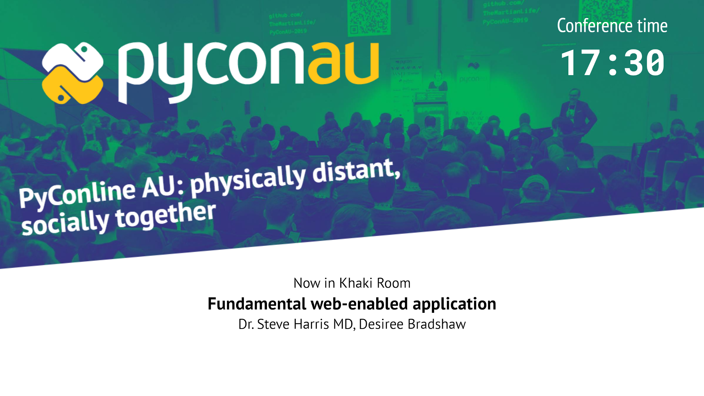
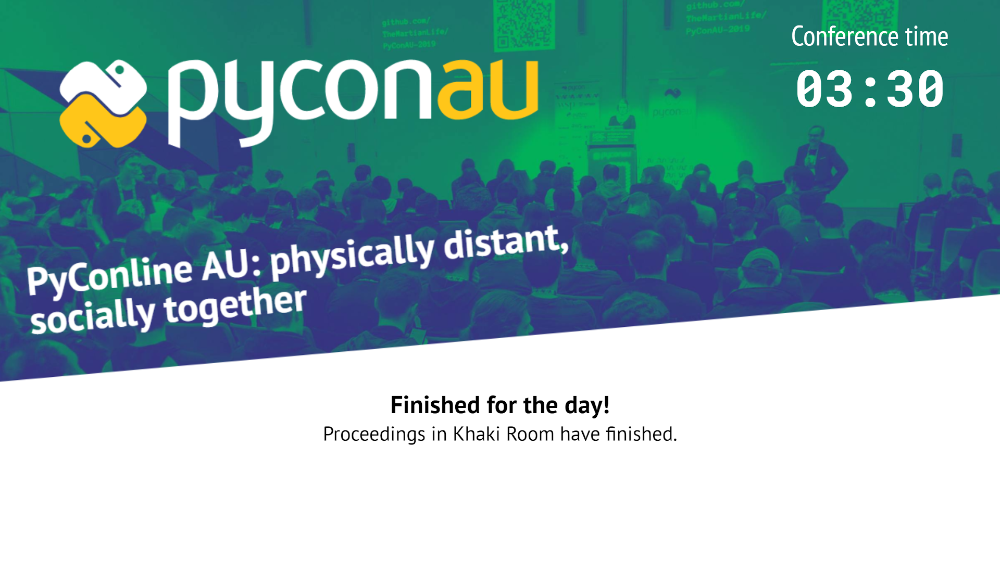

# Slide descriptions

## At all times

* `background.png` is shown
* "Conference time" is shown in the top-right corner:
  * The `timeWarp` option is applied to this value.
  * The time is always displayed in 24-hour time, `HH:MM`.
  * The `:` (colon) blinks: on for one second, off for the next.
* All times are displayed in the timezone that the _browser_ operates in.
  * The browser _should_ be in the same timezone as the conference schedule, but it is not _required_.

## At load time

1. If the `lt=` query parameter is specified, this activates `timeWarp` mode:
   * This is parsed as a JavaScript `Date` object, and converted to a number of milliseconds since UNIX epoch.
   * The current time, according to the browser, is converted to a number of milliseconds since UNIX epoch, and subtracted from the previous value.
   * This becomes the `timeWarp` option, and becomes a persistent offset for displayed times and schedule handling.
   * If this value is invalid, `timeWarp` is set to 0 (no offset).
2. If the `lt=` query parameter is **not** specified, `timeWarp` is set to 0 (no offset).
3. If the `c=1` query parameter is set, **the schedule will not be loaded**.  Only the conference time will be displayed.
4. The current day's schedule is loaded:
   * If the schedule JSON cannot be parsed, an error message is displayed, and **no further processing occurs.**
   * pretalx defines a "day" as starting at 04:00 and finishing at 03:59 in the _conference's timezone_.
   * Any `timeWarp` option is applied to this.
   * The schedule of other days is ignored.
   * The schedule is never reloaded or updated.  Updating requires replacing the schedule JSON file, and then reloading the page (`pyconau-schedule-slide`).
5. If there is no daily schedule available:
   * The message: "No events scheduled today!" is displayed.
   * **No further processing occurs.**
6. Using the `r=` query parameter, we select the appropriate Room's schedule for that day.
   * If the `r=` query parameter is not specified, or an unknown Room is specified, an error is displayed with a list of valid room names for the day, and **no further processing occurs.**
7. The events in the room are sorted by start time, and pushed into `roomSchedule`.
8. The `updateDisplay` function is called, and scheduled to be called again every second.

## Each second (updateDisplay)

Look up the current or next scheduled event in the room.  A current event always takes precedence over an upcoming event.

If there are multiple presenters, their (public) names are shown in the order they appear in the schedule JSON, separated by `, ` (comma and space).

Times are always shown in the _browser's_ timezone, not the _schedule_.

### If there is an event currently in the room:

```
Now in {room}
{title}
{presenter names}
```


  
### If there is an event upcoming in the room:

```
Starting at {time} in {room}
{title}
{presenter names}
```


### If there is no current or upcoming event:
  
```
Finished for the day!
Proceedings in {room} have finished.
```



## In clock-only mode (?c=1):


